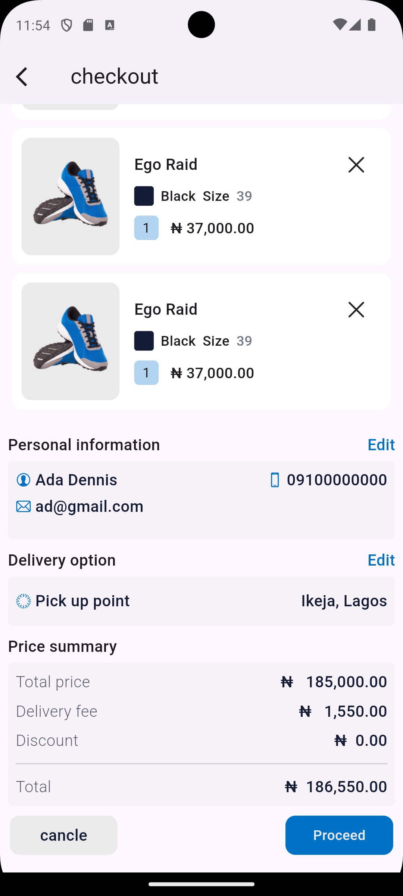
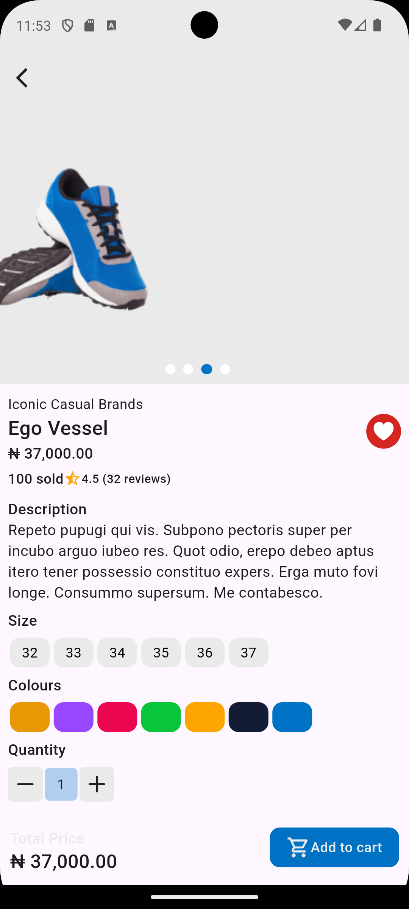
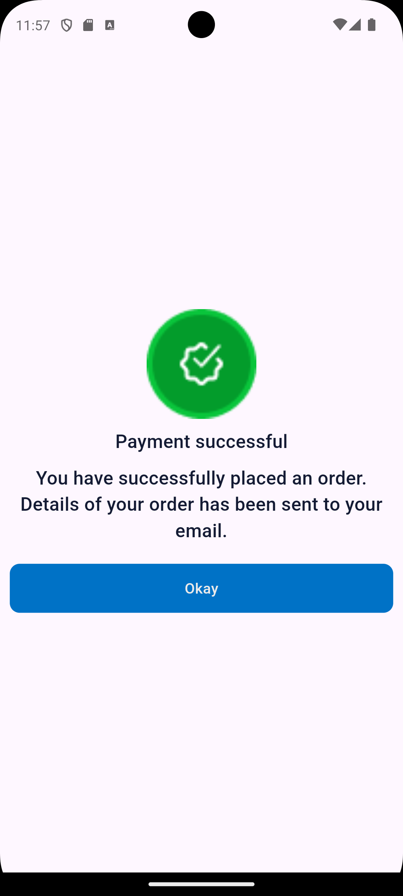

# nike_store


A simple shopping app built with Flutter.

## Description

nike_store is a simple mobile application that allows users to browse through products, add them to a cart, and proceed to checkout. The app demonstrates basic Flutter concepts such as navigation, state management, apis,and custom widgets .

- **Usage:** 
1. Home Screen: Browse through the list of products.
2. Cart: Add products to your cart and view them in the cart page.
3. Checkout: Proceed to checkout and see a success message.
4. ViewProduct:view single product in a page

## Features
- Product listing
- view each product in a page
- cart listing
- Add products to cart
- Remove products from cart
- View total price of products in cart
- Checkout process
## Note
 - This app is built with Flutter and uses the following packages:
## dependencies
- http
- provider
- carousel_slider
- flutter_lorem
- provider: ^6.1.2
- get: ^4.6.6
- hexcolor: ^3.0.1
- smooth_page_indicator: ^1.2.0

## note 2
- users can add product to cart from the viewproduct page cause of th api that was given

## Installation

Follow these steps to set up the project locally:

1. **Clone the repository:**
   ```sh
   git clone  https://github.com/Omozuas/nike_store.git
   cd nike_store
2. **Install Flutter dependencies**
   flutter pub get
3. **Run the app**
   flutter run


## Screenshots

1. **Home Page**


2. **Cart Page**


3. **Checkout Page**


3. **process Page**


4. **viewProduct Page**


5. **success Page**


6. **Cart Page**


- **APK Download:** (https://tsfr.io/join/b6u4dr).
- **APK debug link:** (https://appetize.io/app/b_2fmjq3p2uboqunv3w2e2oo5zgy).
- **Contact Information:** 
- **Name**:`Omozua Judah ` 
- **Email**:`iyanuomozua.email@example.` 
- **GitHub**:(https://github.com/Omozuas)
- **GitHub repo of project**:(https://github.com/Omozuas/superstore.git) 

