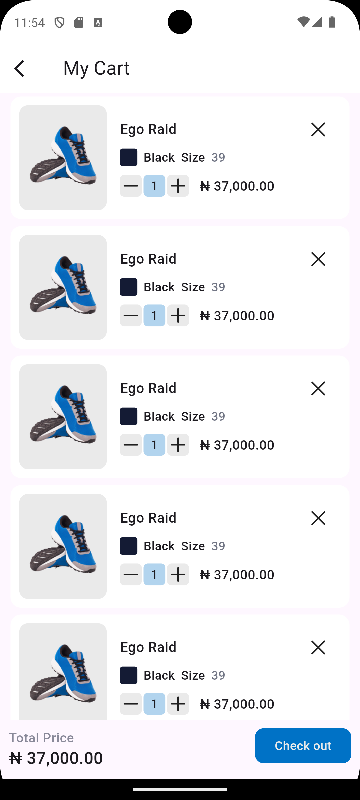
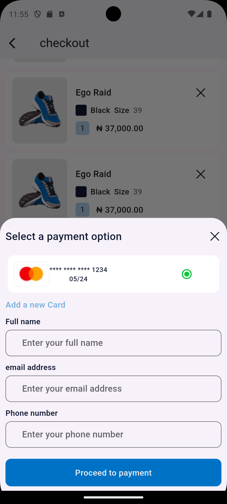
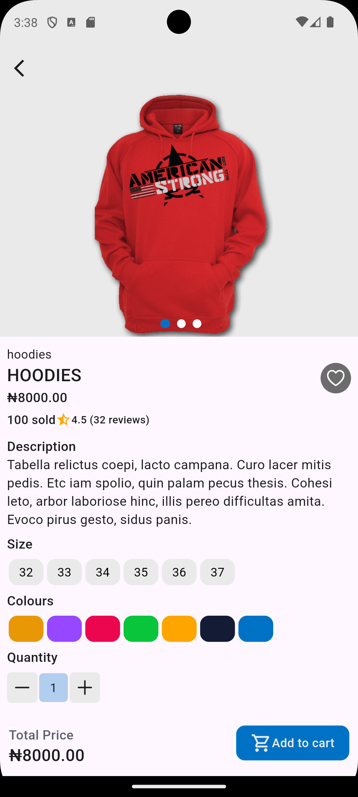
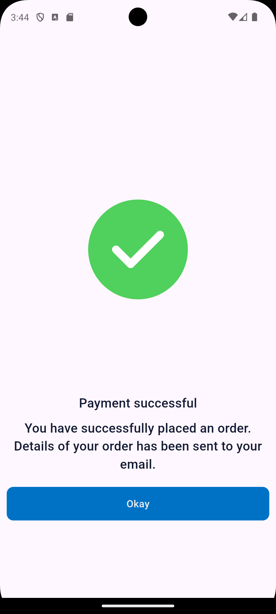
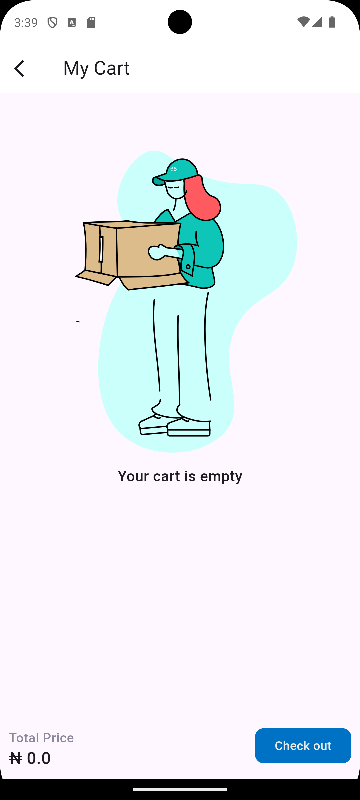
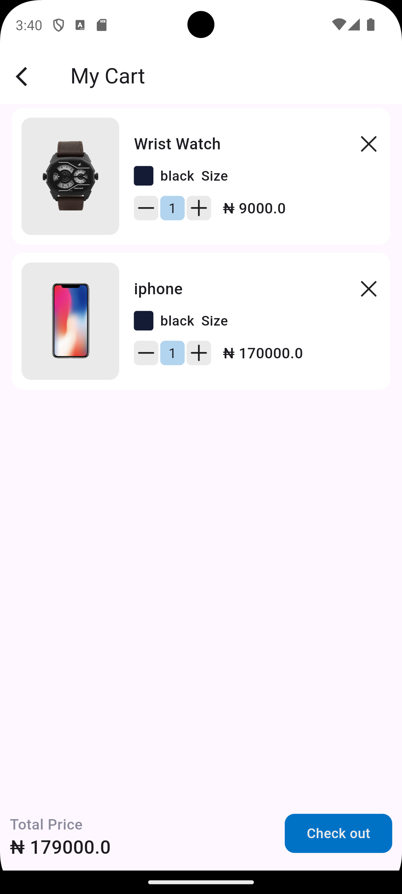
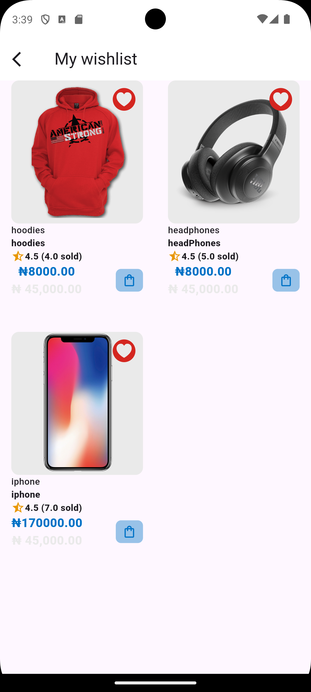
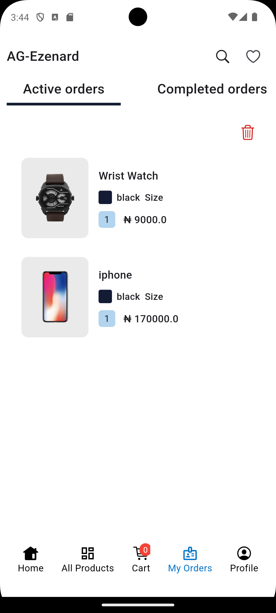
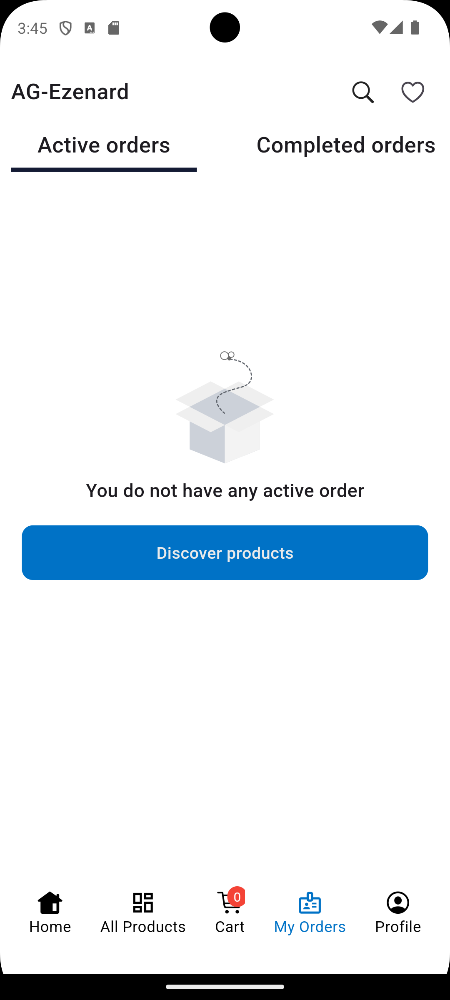
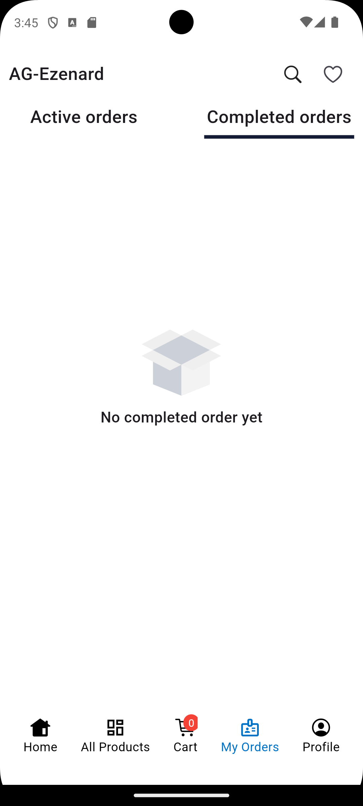

# nike_store


A simple shopping app built with Flutter.

## Description

nike_store is a simple mobile application that allows users to browse through products, add them to a cart, and proceed to checkout. The app demonstrates basic Flutter concepts such as navigation, state management, apis,and custom widgets .

- **Usage:** 
1. Home Screen: Browse through the featured products.
2. Product Screen: Browse through the list of products.
3. Cart: Add products to your cart and view them in the cart page.
4. Checkout: Proceed to checkout and see a success message.
5. ViewProduct:view single product in a page
6. WishList:view all products  added to WishList page
7. Orders:tracking orders(activeorders and CompletedOrders) in orders Page(Note active orders changes to completed oreder after one minute)

## Features
- Home screen with featured products
- Product listing
- view each product in a page
- cart listing
- Add products to cart
- Remove products from cart
- Add products to wishlist
- Remove products from wishlist
- View total price of products in cart
- Checkout process
- View success message after checkout
- tracking orders(activeorders and CompletedOrders)

## Note
 - This app is built with Flutter and uses the following packages:
## dependencies
- http
- provider
- carousel_slider
- flutter_lorem
- provider: ^6.1.2
- get: ^4.6.6
- hexcolor: ^3.0.1
- smooth_page_indicator: ^1.2.0
- shared_preferences: ^2.2.3
- another_flushbar: ^1.12.30
- shimmer: ^3.0.0
- uuid: ^4.4.2
- lottie: ^3.1.2

## note 2
- users can add product to cart from the viewproduct page cause of the api that was given and also add to wishList

## Installation

Follow these steps to set up the project locally:

1. **Clone the repository:**
   ```sh
   git clone  https://github.com/Omozuas/nike_store.git
   cd nike_store
2. **Install Flutter dependencies**
   flutter pub get
3. **Run the app**
   flutter run


## Screenshots

1. **Home Page**


2. **Cart Page**


3. **Checkout Page**


3. **process Page**


4. **viewProduct Page**


5. **success Page**


6. **Cart Page**
 

7. **WishList Page**


8. **ActiveOrder Page**


7. **CompletedOrder Page**
 

- **APK Download:** (https://tsfr.io/join/b6u4dr).
- **APK debug link:** (https://appetize.io/app/b_grltvxj75gapfrzcgo3vel4kdi).
- **Contact Information:** 
- **Name**:`Omozua Judah ` 
- **Email**:`iyanuomozua.email@example.` 
- **GitHub**:(https://github.com/Omozuas)
- **GitHub repo of project**:(https://github.com/Omozuas/nike_store.git) 

